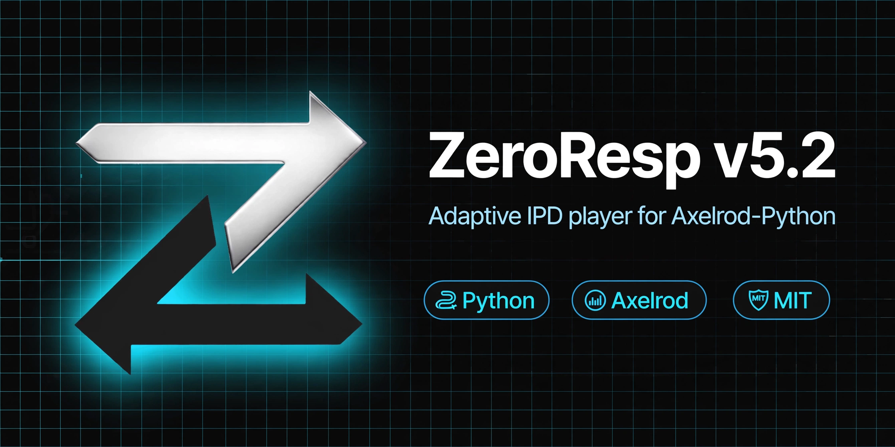

# ZeroResp

**Adaptive strategy for the Iterated Prisoner's Dilemma**  
Version **5.2** · Compatible with [Axelrod-Python](https://github.com/Axelrod-Python/Axelrod) 4.x

[](https://www.python.org/)
[](https://axelrod.readthedocs.io/)
[](LICENSE)

ZeroResp is a long-memory IPD player: epoch debt, delayed retaliation, noise-aware forgiveness, opening disambiguation for D-starters, and finite-horizon harvest. **v5.2 is the production build.** Later probes (cycle-break vs Calculator, WSLS reset, Handshake C,D matching) failed field ablation and are not shipped.

---

## Highlights

| Property | Value |
|----------|--------|
| Display name | `ZeroResp v5.2` |
| Memory | Infinite |
| Stochastic | Yes (forgiveness / harvest jitter) |
| Uses match length | Yes, when finite |
| Class-level profiles | Yes (`manipulates_state: True`) |

---

## Field results (Axelrod 4.14, 32-strategy pack)

Standard PD payoffs R=3, T=5, S=0, P=1. **200 turns × 8 reps × seed 42.**

| Noise | Score / turn | Self-match | Notes |
|------:|-------------:|-----------:|-------|
| 0% | **2.843** | 598 / 600 | Reciprocators & Grudger **602** (last-move harvest) |
| 5% | **2.375** | ~579 | +0.033 SPT vs v5.1 on the same pack |

Empirical best-response oracle (max of always-C, always-D, TFT, Alternator, STFT) shows remaining “gaps” are **exploiter ceilings** (always-D vs Cooperator, Alternator vs Handshake), not failed reciprocity tests. Chasing them grim-triggers Grudger. We stopped there.

v5.1 → v5.2 on 5% noise: Punisher +136, Two Tits For Tat +60, Once Bitten +43, STFT +38. 0% noise essentially unchanged.

---

## Quick start

```bash
pip install axelrod
```

```python
import axelrod as axl
from zeroresp import ZeroResp

match = axl.Match((ZeroResp(), axl.TitForTat()), turns=200, seed=0)
match.play()
print(match.final_score())
```

### Unit tests

```bash
python -m unittest tests.test_zeroresp -v
```

---

## Algorithm (v5.2)

1. **Opening D retort** — if the opponent’s first move is D, answer D on turn 2; if their second was C, resync with C (Prober 3 / Prober). Does **not** D after a C-opener (that would pass Axelrod Handshake and grim-trigger Grudger).
2. **Contrite / bad standing** — if our intended C was realized as D (match noise), the opponent’s reply D is not treated as an attack.
3. **Generous forgiveness** — under estimated noise (`p_noise_est > 1.5%` and enough CC pairs), stochastic forgive; hard-forgive very high coop rates.
4. **Red-line cooldown** — in a noisy regime, grim is temporary with periodic C probes; clean matches still use permanent red line.
5. **End-game harvest** — only with known finite length and a short remaining window; skipped under noisy regime except the last couple of turns.
6. **Profiles** — class-level memory across rematches in a tournament process.

---

## What we did not ship

| Idea | Why it died |
|------|-------------|
| Handshake = play C,D after their C | +~400 vs Handshake, **−400 vs Grudger** |
| Cycle-break D on turn ~20 vs AllC | Calculator hunter; on the field Joss-lock / 5% noise self-match collapse |
| WSLS “C after DD” | Nukes Alternator / Negation |
| v5.3 cycle-break when `opp_defects == 0` | Grudger 602 → 239 |

---

## Repository layout

```
.
├── zeroresp.py                      # Canonical v5.2 module
├── tests/test_zeroresp.py
├── axelrod/strategies/zeroresp.py   # Same module, Axelrod drop-in path
├── benchmarks/RESULTS.md
└── REGISTRATION.md
```

---

## License

MIT. See [LICENSE](LICENSE).
