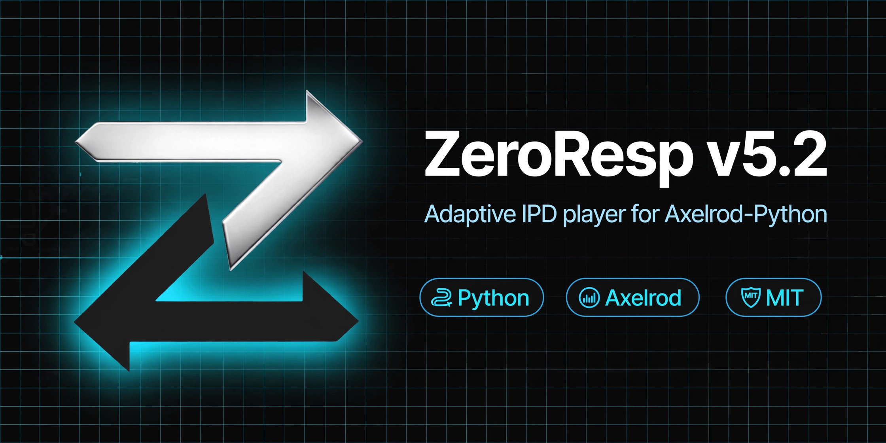

# ZeroResp

**Adaptive strategy for the Iterated Prisoner's Dilemma**  
Version **5.3** · Compatible with [Axelrod-Python](https://github.com/Axelrod-Python/Axelrod) 4.x

[](https://www.python.org/)
[](https://axelrod.readthedocs.io/)
[](LICENSE)

ZeroResp is a long-memory IPD player: epoch debt, delayed retaliation, noise-aware forgiveness, opening disambiguation for D-starters, and finite-horizon harvest. **v5.3 is the production build** (v5.2 plus a noise ladder that activates only after proven channel noise).

---

## Highlights

| Property | Value |
|----------|--------|
| Display name | `ZeroResp v5.3` |
| Memory | Infinite |
| Stochastic | Yes (forgiveness / harvest jitter / ladder delay) |
| Uses match length | Yes, when finite |
| Class-level profiles | Yes (`manipulates_state: True`) |
| New in 5.3 | `Features.noise_ladder` (default on; `--no-ladder` recovers v5.2) |

---

## Field results (Axelrod 4.14, 32-strategy pack)

Standard PD payoffs R=3, T=5, S=0, P=1. **200 turns × 8 reps × seed 42.**

Mean score-per-turn over the field pack (v5.3-I vs v5.2 / ladder off):

| Noise | SPT v5.3 | SPT v5.2 | Δ | Self-match v5.3 → v5.2 |
|------:|---------:|---------:|--:|------------------------:|
| 0% | **3.0374** | 3.0371 | +0.0003 | 598 → 598 |
| 1% | 2.8871 | 2.8856 | +0.0016 | 590 → 591 |
| 3% | **2.7681** | 2.7338 | **+0.0342** | 592 → 590 |
| 5% | 2.6504 | 2.6444 | +0.0060 | **592.5 → 550.2** |
| 10% | 2.4845 | 2.4787 | +0.0058 | 544 → 539 |

Round-robin rank on the field pack: **1 / 33** at 0% and 5% for both builds.  
Full short-run library at 5% noise (200×1): v5.3 **4 / 222**, v5.2 3 / 222.

At 5% noise the ladder’s main win is self-match (+42 points): it stops fighting itself. HardProber improves by about +0.35 SPT; the known soft regression is TrickyCooperator (−0.24 SPT). Details: [`RESEARCH_v53.md`](RESEARCH_v53.md).

---

## Quick start

```bash
pip install axelrod
```

```python
import axelrod as axl
from zeroresp import ZeroResp

match = axl.Match((ZeroResp(), axl.TitForTat()), turns=200, seed=0)
match.play()
print(match.final_score())
```

Disable the v5.3 ladder (v5.2 behavior):

```python
from zeroresp import Features, ZeroResp
ZeroResp(features=Features(noise_ladder=False))
```

### Unit tests

```bash
python -m unittest tests.test_zeroresp tests.test_noise_ladder -v
```

### Local field benchmark

```bash
python benchmarks/run_field.py --pack field --turns 200 --reps 8 --seed 42 --noise 0 0.05
python benchmarks/run_field.py --pack field --turns 200 --reps 8 --seed 42 --noise 0 0.05 --no-ladder
python benchmarks/compare_runs.py OLD.json NEW.json
```

---

## Algorithm

### Inherited from v5.2

1. **Opening D retort** — if the opponent’s first move is D, answer D on turn 2; if their second was C, resync with C.
2. **Contrite / bad standing** — if our intended C was realized as D (match noise), the opponent’s reply D is not treated as an attack.
3. **Generous forgiveness** — under estimated noise, stochastic forgive; hard-forgive very high coop rates.
4. **Red-line cooldown** — in a noisy regime, grim is temporary with periodic C probes.
5. **End-game harvest** — only with known finite length and a short remaining window.
6. **Profiles** — class-level memory across rematches in a tournament process.

### New in v5.3 (noise ladder)

7. **Proven-noise gate** — the ladder stays dormant at 0% noise (behavior matches v5.2).
8. **Unexplained-D evidence ladder** — opponent D after our realized C accumulates evidence; early strikes are deferred / pardonable.
9. **Delayed pardonable retaliation (v5.3-I)** — planned strike with random delay; cancelled if the opponent clears with a clean C streak.

---

## What we did not ship

| Idea | Why it died |
|------|-------------|
| Handshake = play C,D after their C | +~400 vs Handshake, grim-triggers Grudger |
| Cycle-break D on turn ~20 vs AllC | Calculator hunter; Joss-lock / 5% self-match collapse |
| WSLS “C after DD” | Nukes Alternator / Negation |
| v5.3 cycle-break when `opp_defects == 0` | Grudger 602 → 239 |

---

## Repository layout

```
.
├── zeroresp.py                      # Canonical v5.3 module
├── RESEARCH_v53.md                  # v5.3 vs v5.2 evidence summary
├── tests/test_zeroresp.py
├── tests/test_noise_ladder.py
├── axelrod/strategies/zeroresp.py   # Same module, Axelrod drop-in path
├── benchmarks/run_field.py          # Local field runner
├── benchmarks/compare_runs.py
├── benchmarks/RESULTS.md
└── REGISTRATION.md
```

---

## License

MIT — see [LICENSE](LICENSE).
